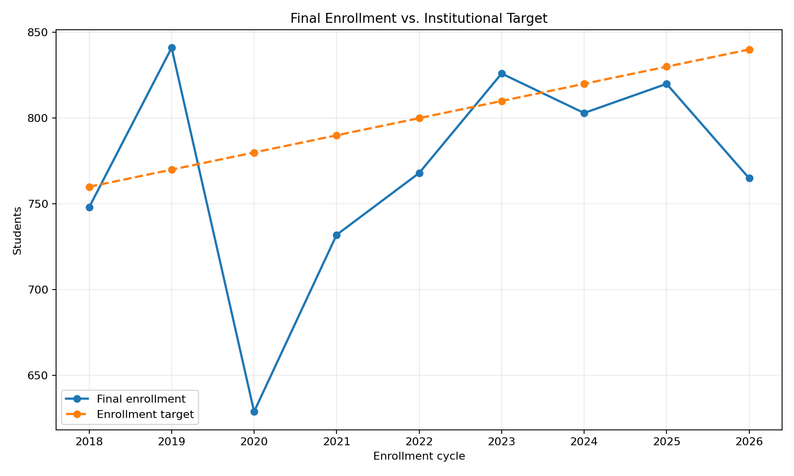
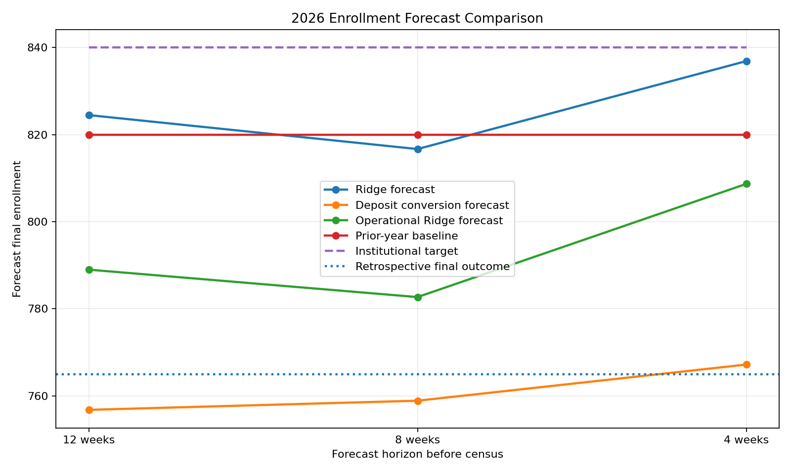
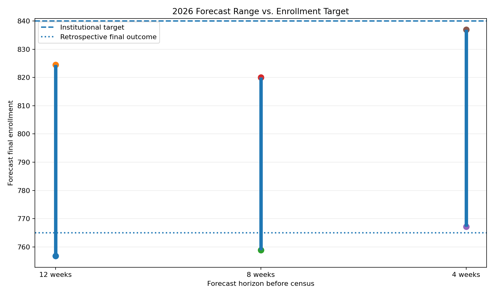

# Education Enrollment Forecasting & Decision Support

A synthetic higher-education analytics project demonstrating how forecasting, model validation, and decision-support methods can help leaders identify enrollment risk before final enrollment is known.

## Executive Summary

Enrollment leaders often need to make staffing, budgeting, and resource-allocation decisions weeks or months before final enrollment is known.

This project asks:

> **Can an education organization forecast final enrollment early enough to support decisions—and how should leaders respond when reasonable forecasting methods disagree?**

Using a fully synthetic nine-cycle enrollment environment, I developed and compared multiple forecasting approaches at 12, 8, and 4 weeks before census.

The analysis produced an important result:

**The historically strongest model did not provide the strongest warning in an unusual enrollment cycle.**

Four weeks before census:

| Measure | Students |
|---|---:|
| Institutional target | **840** |
| Ridge regression forecast | **837** |
| Prior-year baseline | **820** |
| Operational Ridge forecast | **809** |
| Deposit-conversion forecast | **767** |
| Retrospective final enrollment | **765** |

A decision-maker relying only on the multivariable Ridge forecast could reasonably have concluded that enrollment was approximately on target.

However, the full set of forecasting approaches showed a range of approximately **70 students**, revealing meaningful downside exposure that a single point forecast obscured.

## Decision Question

The fictional institution in this project—**Northstar University**—needs to answer three questions during its admissions cycle:

1. Where is final enrollment likely to finish?
2. How reliable are forecasts made before census?
3. When forecasting approaches disagree, what should leadership do with that information?

The objective is not simply to produce the most accurate model.

The objective is to provide decision-makers with a clearer understanding of **expected enrollment, downside exposure, and the limitations of the available evidence**.

---

## Synthetic Data Environment

The project uses completely synthetic data representing nine fall enrollment cycles from **2018 through 2026**.

Each cycle contains 26 weekly observations describing the developing enrollment funnel.

Variables include:

- cumulative applications
- cumulative admits
- cumulative deposits
- cumulative financial-aid offers
- deposit rate to date
- year-over-year application change
- year-over-year deposit change
- projected net tuition
- institutional enrollment target
- final enrollment

The synthetic environment includes historical variation, an enrollment disruption, recovery, changing conversion behavior, and a 2026 cycle in which strong top-of-funnel activity does not translate cleanly into final enrollment.

**No student, institutional, client, or proprietary data are used.**

---

## Data Integrity

Before modeling, the generated data were tested for structural and logical consistency.

Validation checks confirm:

- every enrollment cycle contains 26 weeks
- cumulative measures never decrease
- admits do not exceed applications
- deposits do not exceed admits
- aid offers do not exceed admits
- deposit rates remain within valid bounds
- enrollment targets and outcomes are positive
- missing values occur only where expected for first-year year-over-year calculations

The initial synthetic generator failed the cumulative-monotonicity test because independent weekly variation occasionally caused cumulative counts to decline.

The generator was corrected and the full dataset was revalidated before analysis continued.

This step is included intentionally: **model quality depends on data integrity.**

---

## Historical Enrollment Context



The synthetic environment contains meaningful variation rather than a perfectly predictable enrollment process.

It includes a substantial disruption in 2020, subsequent recovery, several cycles close to institutional target, and a material 2026 shortfall.

---

## Exploratory Analysis

Exploratory analysis examined how applications, deposits, and conversion measures relate to eventual enrollment at different points in the admissions cycle.

One important pattern emerged:

**Application volume alone was not a sufficient indicator of eventual enrollment.**

At the selected forecast horizons, cumulative deposits showed a stronger descriptive relationship with final enrollment than cumulative applications.

Because the project contains only nine independent enrollment cycles, these correlations are treated as exploratory signals rather than precise estimates of predictive performance.

---

## Forecasting Approach

Forecasts were generated at three operationally relevant horizons:

- **12 weeks before census**
- **8 weeks before census**
- **4 weeks before census**

Four approaches were compared.

### 1. Prior-Year Baseline

A simple benchmark assuming final enrollment will equal the prior year's final enrollment.

This provides a minimum standard against which more sophisticated methods can be evaluated.

### 2. Deposit-Conversion Forecast

An interpretable operational method based on the historical relationship between deposits observed at a given point in the cycle and eventual final enrollment.

### 3. Ridge Regression

A regularized multivariable model incorporating:

- enrollment target
- cumulative applications
- cumulative admits
- cumulative deposits
- cumulative aid offers
- deposit rate
- application year-over-year change
- deposit year-over-year change

Ridge regression was selected instead of a more complex machine-learning algorithm because the number of independent historical enrollment cycles is small.

### 4. Operational Ridge

A narrower Ridge specification using primarily deposit-related indicators.

This model was included as a sensitivity test to examine whether restricting the model to downstream operational signals improved robustness.

---

## Time-Aware Validation

The project does **not** randomly split the 234 weekly observations into training and testing datasets.

Doing so would allow observations from the same enrollment cycle to appear in both sets and would overstate model performance.

Instead, forecasting methods are evaluated using expanding-window walk-forward validation.

For example:

```text
Train: 2018–2021  →  Test: 2022
Train: 2018–2022  →  Test: 2023
Train: 2018–2023  →  Test: 2024
Train: 2018–2024  →  Test: 2025
```

The 2026 cycle is then held out from this validation exercise and used as a retrospective decision-support case.

### Historical Mean Absolute Error

| Weeks before census | Ridge | Deposit conversion | Prior-year baseline | Operational Ridge |
|---:|---:|---:|---:|---:|
| 12 | **32.0** | 48.2 | 33.5 | 55.0 |
| 8 | **21.8** | 26.9 | 33.5 | 52.3 |
| 4 | **19.1** | 38.1 | 33.5 | 54.0 |

Across the four walk-forward test cycles, Ridge regression produced the lowest mean absolute error at all three forecast horizons.

The small validation sample means these differences should not be interpreted as proof that Ridge would universally outperform the alternatives.

---

## The 2026 Decision Problem

Historical validation alone does not tell the entire story.

When the validated forecasting approaches were applied to the synthetic 2026 cycle, they produced materially different conclusions.



At four weeks before census:

- Ridge forecast: **837**
- Institutional target: **840**
- Deposit-conversion forecast: **767**
- Operational Ridge forecast: **809**
- Prior-year baseline: **820**

The Ridge model—the strongest historical performer—suggested that enrollment was essentially on target.

The deposit-based operational forecast suggested substantial downside.

The retrospective synthetic outcome was **765 students**.

---

## Model Disagreement as Decision Information

Rather than selecting one forecast and hiding the others, the decision-support layer surfaces disagreement across plausible approaches.



| Forecast horizon | Lowest forecast | Highest forecast | Model spread |
|---:|---:|---:|---:|
| 12 weeks | 757 | 825 | 68 |
| 8 weeks | 759 | 820 | 61 |
| 4 weeks | 767 | 837 | 70 |

The displayed range is **not a statistical confidence interval or prediction interval**.

It represents the spread across different forecasting approaches and is used as a decision-support diagnostic.

The analysis does not establish that model disagreement is itself a statistically validated predictor of enrollment risk. Instead, substantial disagreement is treated as a reason for additional investigation before leadership relies on a single point estimate.

---

## Executive Interpretation

Four weeks before census, a leader looking only at the historically strongest model could have seen:

> **Forecast enrollment: 837**  
> **Target: 840**

That result appears reassuring.

But the broader forecasting framework showed plausible estimates ranging from approximately **767 to 837 students**.

That changes the management question from:

> "Are we on target?"

to:

> **"Why are reasonable forecasting approaches giving us materially different answers, and what should we investigate before committing resources?"**

A reasonable management response would be to investigate:

- conversion behavior
- segment-level deposit patterns
- potential melt risk
- recruitment-pipeline quality
- changes in student mix
- financial-aid behavior

before making enrollment-dependent staffing, budget, or resource commitments.

---

## Key Takeaway

This project demonstrates why analytics leadership requires more than selecting the model with the lowest historical error.

A forecasting system should help leaders understand:

**What is the expected outcome?**

**How well has the method performed on unseen historical periods?**

**What other reasonable methods imply a different outcome?**

**What assumptions may be changing?**

**When should model output trigger additional investigation rather than automatic action?**

In this synthetic case, the historically strongest model provided a near-target forecast during an unusual cycle, while a simpler operational method captured substantially more downside.

The appropriate response is not to assume that the simpler model will always be superior.

It is to recognize that **model disagreement itself can be decision-relevant information that should be surfaced rather than hidden.**

The repository includes the synthetic data-generation process, validation checks, forecasting workflow, walk-forward evaluation, diagnostic analysis, and decision-support outputs used to produce this demonstration.
---

## Project Structure

```text
education-enrollment-forecasting/
│
├── data/
│   └── synthetic_enrollment_funnel.csv
│
├── outputs/
│   ├── figures/
│   │   ├── enrollment_vs_target.png
│   │   ├── forecast_comparison_2026.png
│   │   └── forecast_range_2026.png
│   │
│   ├── forecast_2026.csv
│   ├── forecast_method_summary.csv
│   ├── walk_forward_validation.csv
│   └── decision_support_summary.csv
│
├── src/
│   ├── generate_data.py
│   ├── validate_data.py
│   ├── explore_data.py
│   ├── forecast.py
│   ├── diagnose_divergence.py
│   └── build_decision_support.py
│
├── requirements.txt
├── .gitignore
├── LICENSE
└── README.md
```

---

## Reproducing the Analysis

Install dependencies:

```bash
pip install -r requirements.txt
```

Generate the synthetic dataset:

```bash
python src/generate_data.py
```

Validate the data:

```bash
python src/validate_data.py
```

Run exploratory analysis:

```bash
python src/explore_data.py
```

Run forecasting and walk-forward validation:

```bash
python src/forecast.py
```

Run the funnel diagnostic:

```bash
python src/diagnose_divergence.py
```

Build the executive decision-support outputs:

```bash
python src/build_decision_support.py
```

---

## Tools

**Python · pandas · NumPy · scikit-learn · Matplotlib**

---

## Limitations

This is a demonstration project using synthetic data and a deliberately small number of independent enrollment cycles.

Important limitations include:

- only nine synthetic enrollment cycles are available
- walk-forward validation contains only four test cycles
- model-spread thresholds are illustrative decision rules, not statistically estimated risk thresholds
- the forecast range is not a confidence or prediction interval
- aggregate weekly data cannot capture student-level heterogeneity
- synthetic results should not be interpreted as empirical findings about any real institution

A production implementation would require substantially more historical data, institutional context, subgroup analysis, forecast calibration, uncertainty estimation, and ongoing model monitoring.

---

## About

This project was developed by **Rebecca Osakwe**, an economist and analytics leader with experience building decision-support systems across higher education, government, and applied analytics environments.

My work focuses on translating data, statistical analysis, and AI-enabled analytical methods into decision-relevant insight for organizations facing complex operational and strategic questions.
